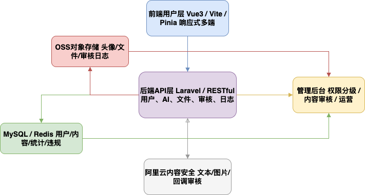

# php-gpt-assistant

> 🚀 开箱即用的全栈 AI 聊天助手平台 —— 专为开发者和团队打造，兼顾“AI体验、安全合规、二次扩展”三大核心价值。

## 核心特性

- **AI 智能交互体验**
    - 支持 GPT-3.5/GPT-4 及多模型灵活切换
    - 聊天支持 Markdown、代码高亮、连续多轮上下文
    - 会话窗口支持 Prompt 个性定制、历史搜索、消息重试/复制/编辑
    - Token 消耗实时统计，成本清晰可控

- **安全与认证体系**
    - 全链路 JWT 鉴权、接口权限精细控制
    - 图形验证码、短信/邮箱验证码，防刷防爆破
    - 支持谷歌二步验证（Google Authenticator），账户保护升级
    - 阿里云内容安全审核（文本/图片），违规实时拦截、回调可追溯
    - 所有用户上传/操作/审核日志统一归档至 OSS

- **团队协作与扩展能力**
    - 多角色多用户支持，管理后台权限灵活
    - API Key 独立管理、分组/禁用、支持团队密钥
    - RESTful API 友好，适配前端/小程序/第三方业务接入
    - 支持多端多语言（中英文可切换）、响应式设计
    - 组件式页面结构，便于功能拓展和二次开发

---

## 页面与功能总览

### 1. 用户认证与设置
- **登录 / 注册**：图形+短信/邮箱验证码，安全登录
- **个人资料页**：昵称/邮箱/头像裁剪上传（本地预览+OSS存储）
- **API Key 管理**：绑定/更新/团队Key分组
- **二步认证**：支持Google Authenticator扫码绑定

### 2. AI 聊天与内容管理
- **多模型会话页**：GPT-3.5/GPT-4选择、系统Prompt自定义、消息历史、上下文关联
- **会话窗口**：Markdown渲染、代码高亮、消息状态/动画、快捷操作（复制/编辑/重试）
- **Token 消耗统计页**：按天/会话统计Token用量，图表可视化
- **历史消息中心**：搜索/筛选/导出/批量管理
- **消息/内容审核**：图片、文本自动走内容安全（阿里云Green），结果友好提示

### 3. 管理与运维
- **管理后台**：用户/内容/API Key/违规内容管理，权限分级，操作日志可查
- **系统日志与合规**：所有操作和审核日志归档OSS，支持导出、溯源、合规自查
- **团队扩展**：多用户协作、API Key分发、开放API对接小程序/第三方服务

### 4. 界面与交互亮点
- 响应式布局（桌面/移动端自适应）
- 主题切换（明/暗模式），多语言国际化
- 全局 Loading、骨架屏、错误提示、友好交互细节
- 头像裁剪上传体验丝滑

---

## 技术架构

- **前端**：Vue3 + Vite + Pinia + TailwindCSS
- **后端**：Laravel + JWT + MySQL + Redis + OSS/内容安全SDK
- **部署**：Docker/宝塔均支持，一键上线
- **日志/合规**：所有敏感操作与审核归档 OSS，支持自动清理、定时导出

---

## 适用场景

- 企业/团队 AI 生产力平台
- 独立开发者作品集/全栈能力展示
- 内容安全合规型聊天工具
- 需要灵活扩展与多端适配的SaaS基础框架

---

## 快速开始

详见 [SETUP.md](./SETUP.md) / [DEPLOY.md](./DEPLOY.md)

## 在线体验🎉

> Demo：`http://chat.51dsn.com/`  
> 账号/密码：`demo@example.com` / `123456`（体验账号可选）
> 
---

## 贡献与交流

欢迎 Issue/PR/Star，也欢迎业务合作与定制开发！

---

## 项目预览

### 登陆

### 注册

### 聊天

### 设置

### 主题切换

